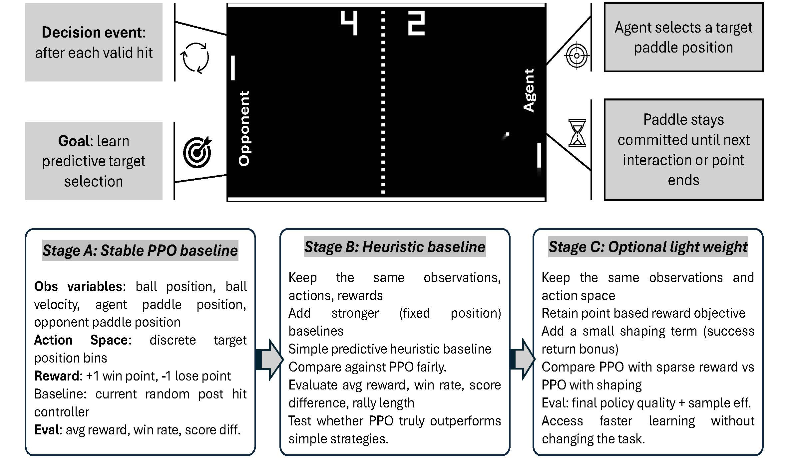
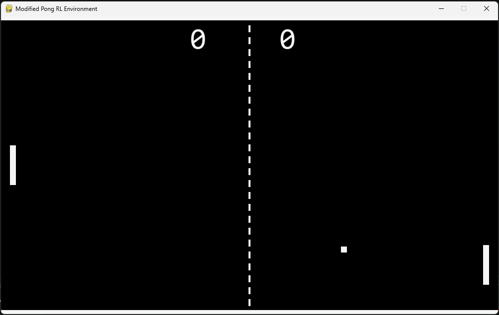

# Predictive Target Selection in Modified Pong with Event-Driven PPO

This project studies whether a **state-based, event-driven Proximal Policy Optimization (PPO) agent** can learn an effective predictive target-selection strategy in a custom modified Pong environment. Unlike conventional frame-by-frame Pong control, the agent acts only at **decision events**: after a valid interaction, it selects a target vertical paddle position and remains committed to that target until the next interaction or the point ends.

The repository provides a complete reproducible reinforcement learning workflow, including:

- a custom Gymnasium-compatible modified Pong environment,
- handcrafted baseline controllers,
- PPO training with checkpointing and periodic evaluation,
- post-training policy analysis,
- result tables and publication-ready figures,
- a compact 50-episode gameplay video,
- saved trained PPO models.

---

## Project objective

The main research question is:

> Can an event-driven PPO agent learn a predictive post-hit target-selection policy that clearly outperforms random and simple fixed-position controllers in modified Pong?

A related methodological question is whether a **physics-informed predictive observation feature** and **light dense target-alignment shaping** can support more efficient learning while preserving the primary point-winning objective.

---

## Methodological overview

The project follows a staged development pipeline:

1. **Custom event-driven Pong environment**
2. **Non-learning baseline controllers**
3. **PPO training and periodic validation**
4. **Checkpoint-wise and final-model evaluation**
5. **Gameplay visualization and reproducible result export**



---

## Modified Pong environment

The environment reformulates Pong as a predictive control problem rather than a reactive tracking problem.

### Core design

- The **right paddle** is controlled by the learned policy.
- The **left paddle** follows a deterministic high-performing opponent controller.
- The agent does **not** choose movement commands each rendered frame.
- Instead, the agent selects one **target paddle position** only at valid decision events.
- The paddle then moves toward that selected position until the next interaction.

This makes the task closer to **strategic post-hit target selection** than to classical low-level paddle tracking.



---

## Observation space

The PPO agent receives a compact normalized nine-dimensional observation vector:

1. Ball horizontal position  
2. Ball vertical position  
3. Ball horizontal velocity  
4. Ball vertical velocity  
5. Agent paddle center position  
6. Opponent paddle center position  
7. Relative vertical ball-agent-paddle offset  
8. Relative vertical ball-opponent-paddle offset  
9. Predicted vertical return location of the ball at the next right-paddle interaction  

The final variable is a **physics-informed predictive feature** derived from the ball trajectory, including wall reflections. This enables the policy to reason about where the ball is expected to return rather than only reacting to its instantaneous position.

---

## Action space

The action space is discrete:

- The legal vertical paddle range is divided into `11` target-position bins.
- Each action selects one target bin.
- The target selection remains fixed until the next valid decision event or point termination.

This keeps the policy interpretable and produces a controlled target-selection formulation.

---

## Reward function

The environment combines the main task reward with light shaping:

- `+1` for winning a point,
- `-1` for losing a point,
- a small successful-return bonus,
- a dense target-alignment shaping reward.

The target-alignment reward is larger when the selected target paddle position is closer to the predicted future ball return location. The shaping term remains small relative to the terminal point reward so that the overall objective is still point success rather than auxiliary reward maximization.

---

## Implemented policies

### PPO policy

The learned policy is trained using:

- Stable-Baselines3 PPO,
- an MLP policy network,
- clipped policy updates,
- generalized advantage estimation through the PPO implementation,
- periodic custom validation callbacks,
- checkpoint saving,
- TensorBoard-compatible logging,
- post-training held-out evaluation.

### Non-learning baseline controllers

The repository evaluates five handcrafted reference policies:

| Policy | Description |
|---|---|
| `random` | Randomly selects a target-position bin |
| `center` | Always targets the center paddle position |
| `top` | Always targets the topmost bin |
| `bottom` | Always targets the lowest bin |
| `heuristic_predictive` | Selects the target bin closest to the predicted future return position |

The predictive heuristic is intentionally strong and serves as an analytically informed benchmark, not merely a weak sanity-check baseline.

---

## Final held-out evaluation

All final policy comparisons were evaluated over `300` episodes with fixed evaluation settings.

| Policy | Win rate | Mean reward | Mean score difference | Mean successful returns |
|---|---:|---:|---:|---:|
| `heuristic_predictive` | `0.9967` | `1.6534` | `0.9967` | `8.7267` |
| `ppo_final` | `0.8167` | `0.8271` | `0.6333` | `2.1200` |
| `ppo_best_by_win_rate` | `0.3767` | `-0.1537` | `-0.2467` | `0.7833` |
| `center` | `0.1533` | `-0.6513` | `-0.6933` | `0.2633` |
| `top` | `0.1133` | `-0.7523` | `-0.7733` | `0.1267` |
| `random` | `0.1067` | `-0.7579` | `-0.7867` | `0.1300` |
| `bottom` | `0.1000` | `-0.7843` | `-0.8000` | `0.0933` |

### Interpretation

The final PPO model substantially outperforms all random and fixed-position baselines. The analytically designed predictive heuristic remains stronger, which is expected because it explicitly computes the predicted return location using environment dynamics. This creates a useful comparison: the PPO agent learns a meaningful predictive policy, but it does not fully match a handcrafted trajectory-aware controller.

The checkpoint-level evaluation additionally showed that the `350,000`-step PPO checkpoint achieved the highest evaluated PPO win rate among saved checkpoints, while the final `500,000`-step model remained close and is retained as the primary final training artifact.


---

## Run from console

Clone and build the executable jar (with dependencies) and run by passing the scenario config path:

```bash
git clone https://github.com/parishwadomkar/AI_coding.git
cd AI_coding

```
To produce an executable code..


---
## License

GPL-3.0. See `LICENSE`.
The project is built upon contributions by the MATSim community which are themselves licensed under the GPL License. Classes that were directly adapted from such projects contain author details, modification notices and the original license texts. 

---
## Contact / support

**Omkar Parishwad**  
Urban Mobility Research Group  
Chalmers University of Technology  
mail: omkarp@chalmers.se  

For bugs, questions, or collaboration, please open a GitHub Issue in this repository.


---
## Associated Articles


---
